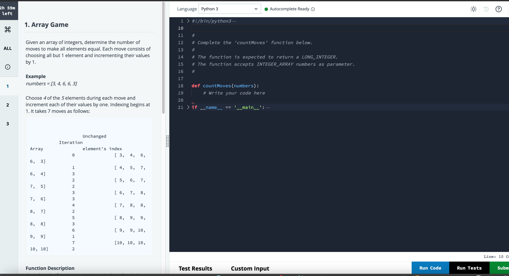

# Array Game 

Given an array of integers, determine the number of moves to make all elements equal. Each move consists of choosing all but 1 element and incrementing their value by 1.

For example, ```numbers = [3,4,6,6,3 ``` will takes 7 moves (begins at 1).




To execute, run on terminal:

```py
python3 -m unittest
```

